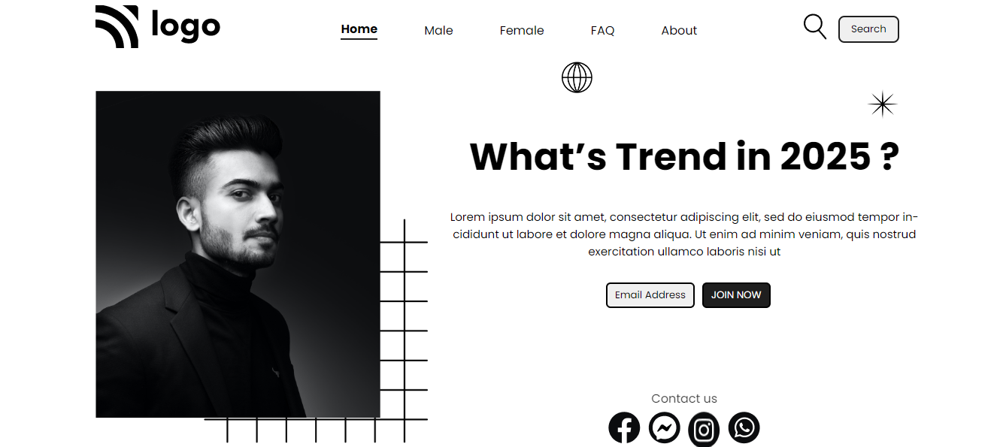

## By Akshun Verma

Mainly In this project I have learnt various positions like relative , absolute and fixed and it helps me 
to enhance my skills in css.

Time to finish : 2 hour

[website link](https://first-project-ineuron.netlify.app/)

